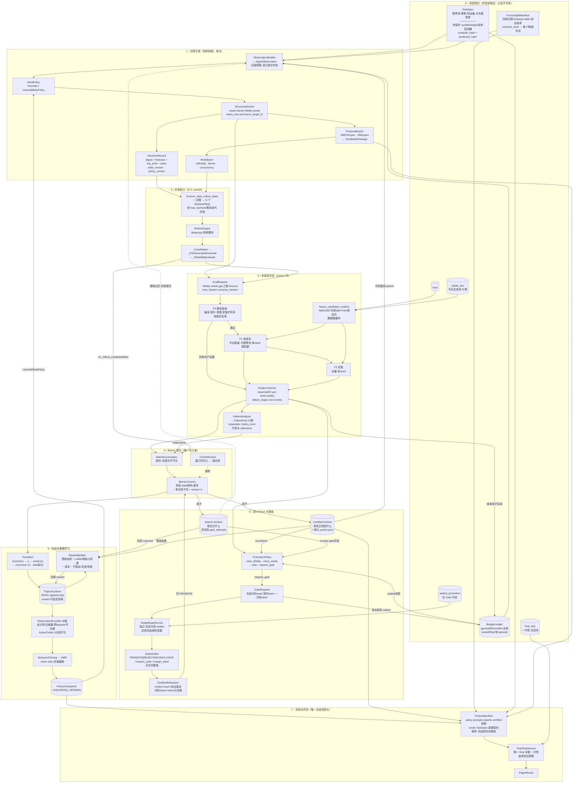

# EvoQuant Reliability Agent — 当前架构

> 本文档描述**已实现的系统**，不是设计意图。
> 代码量：`famou/reliability/` 5,942 行 + 框架层改动 + 测试 2,785 行（176 passed）。
> 最后验证：真实 CSI300 数据端到端跑通（RankIC 0.058 → 0.068）。

---

## 0. 一句话

> Agent 不是"生成一个模型"，而是在有限预算下持续决定：**生成什么候选、投入多少评估资源、相信哪些证据、哪些候选值得进入可信种群** —— 并通过轨迹数据训练出这套搜索策略本身。

被学习的是**搜索策略**，不是股票预测模型。候选始终由 Proposal Expert 产生。

---

## 1. 完整数据流



---

## 2. 九条设计不变量（代码强制，非文档约定）

| # | 不变量 | 强制方式 |
|---|---|---|
| 1 | Agent 永不见 sealed/final 数据或任何 sealed 数值 | `GateVerdict` 无数值字段；gate 异常也吞掉 |
| 2 | 失败候选也产生 Evidence | `FidelityEvaluator` 捕获异常转证据 |
| 3 | Search Archive 成员 ≠ 可信 | 只有 PROMOTE 经 `CertifiedAdmission` 才入 Certified |
| 4 | sealed/final 预算按 episode 隔离 | `BudgetLedger` 分账，跨 episode 无法套利 |
| 5 | 一个候选一次 gate（同代证据） | `SearchArchive.gate_attempts` + 观察层去重 |
| 6 | ICIR 是 run 内时序比率 | harness 上报，绝不由跨 seed 离散度重建 |
| 7 | **Barrier 是两个 Archive 的唯一写入者** | `CommitGuard` 窗口外写入抛 `ArchiveWriteOutsideBarrier` |
| 8 | 候选只拥有预测模型和训练配置 | `TaskSpec.protected_symbols` + F0 静态检查 |
| 9 | final_test 一次性、单向 | `FinalTestService` 不持有任何可写存储；反射验证无组件接受 `PaperResult` |
| 13 | 动作记录的是**实际执行的** expert/family | `_resolve_action` 写入 `resolved_*`，`ActionCodec` 按实际值编码，learned policy 被 mask 到可达集合 |

### 动作空间的真实规模（实测）

名义 2880（6×5×3×4×2×4），但多个头存在别名坍缩：

| 头 | 名义 | 实际 | 原因 |
|---|---|---|---|
| expert | 6 | 1–2 | `crossover`/`debug`/`fusion` 无实现；`NNExpert.propose` 不读 kind |
| family | 5 | 2–4 | `linear` 无 expert（退到 gbdt）；runtime `_FAMILIES` 里 `linear→_train_gbdt`、`temporal_transformer→_train_mlp` |
| fidelity | 3 | 2 | F0 是静态检查，`_mask` 已置 -inf |
| batch | 4 | 4 | 真实 |
| promote | 2 | 2 | 真实 |
| retrieval | 4 | 2（formula 模式 1）| `FormulaExpert` 不读 guidance 约束 |

| 模式 | 名义 | 实际 |
|---|---|---|
| formula | 2880 | ~32 |
| model | 2880 | ~64 |
| mixed | 2880 | ~192 |

不变量 13 让轨迹如实反映这一点：别名动作现在编码相同，训练不会再在不存在的区别上浪费容量。**但它没有新增能力** —— proposal 那一维（expert × family）在 mixed 下实际只有 2×4，这是论文主张里最薄的一条腿。

**为什么 #7 最关键**：`AgentObservation` 完全由两个 Archive 构建 —— Archive 的内容**就是** Agent 眼中的世界。若 rollout 完成即写库，一个 batch 里第 2 个跑完就改变了下一次决策看到的状态，而该状态没有版本号、取决于 worker 调度顺序、离线 RL 重放时无法复现。单一事务写入者让"实时 archive"和"最后提交状态"重合，因此 `ObservationBuilder` 可以直接读，不存在会漂移的影子快照。

---

## 3. 一次完整迭代

```
① Evolver 取下一个迭代槽 → _plan_rollout_tasks
② Strategy.forward_batch()（控制线程）
   ├─ 决策期检索：MemoryRetriever.retrieve(at_version=n, top_k=4)
   ├─ ObservationBuilder 在【最后提交版本 n】构建观察（含检索摘要 6 维）
   ├─ MetaPolicy → StructuredAction（含 retrieval_top_k）
   ├─ DecisionRecord（特征 / log_prob / value / retrieval_bundle_ids）→ TrajectoryStore
   ├─ 生成期检索：按 action.retrieval_top_k + model_family 过滤 → ExperienceGuidance
   ├─ ProposalExpert × batch_size（受 guidance 约束）→ CandidatePackage
   └─ BatchAccumulator(expected=N) 开启
③ Evolver 并发派发 N 个 BackendTask（每个占一个迭代槽）
④ 各 worker 内：_ReliabilityEvaluate
   ├─ F0 静态检查（TaskSpec 驱动）
   ├─ EvalRequest（action 上限 ∩ TaskSpec 上限）
   ├─ famou_candidate_runtime 子进程训练 → EvidenceVector
   └─ 预算原子扣减（共享 ledger，deepcopy 保持引用）
⑤ on_rollout_complete/failed × N → 暂存（此时仍不可见）
⑥ 最后一个到齐：
   ├─ PromotionPolicy（用整批证据判断）
   ├─ 若 request_gate → BudgetedGate → SealedGateService
   └─ BarrierCommit：校验 → 单次原子写两个 Archive + Experience Index → version n+1 → Transition
⑦ Transition → TrajectoryStore（reward 此时仍为 None）
⑧ 搜索跑结束：Strategy.finalize_rewards() → RewardBuilder.mature_all()
   ├─ 只回填本进程写入的 transition（session_transitions）
   └─ incumbent 沿 transition 顺序前推，不用终态读数（避免 lookahead）
⑨ build_dataset → BC →（reward 够多时）AWR → PolicyCheckpoint
⑩ LearnedMetaPolicy 加载 checkpoint，回到 ②；iterate_policy.py 驱动 ②–⑨ 的多轮迭代
```

**为什么 ⑧ 不放在 commit 里**：一个候选可能在若干决策之后才被升到 F2 并送 gate，
它的 reward 属于当初生成它的那条 transition。commit 时刻还不知道结果，所以
maturation 天然是跑结束后的一遍扫描，而不是提交路径的一部分。

---

## 4. 组件清单（全部已实现）

### `famou/reliability/`（5,942 行）

| 模块 | 行数 | 内容 |
|---|---|---|
| `types.py` | 750 | TaskSpec · FrozenSplitManifest · EvidenceVector · CandidatePackage · QuantModelSpec · EvalRequest · GateVerdict · DecisionRecord · Transition · PaperResult |
| `strategy.py` | 942 | ReliabilityAwareQuantStrategy · HeuristicMetaPolicy · `_ReliabilityEvaluate` |
| `experts/` | 520 | ProposalExpert · GBDTExpert · NNExpert · 候选模板 |
| `archives.py` | 428 | SearchArchive · CertifiedArchive · CertifiedAdmission · **CommitGuard** |
| `rl/trainer.py` | 424 | BehaviorCloning · AdvantageWeightedRegression · build_dataset |
| `evaluator.py` | 406 | StaticChecker · EvidenceBuilder · FidelityEvaluator |
| `promotion/` | 330 | PromotionPolicy · SealedGateService · BudgetedGate |
| `barrier.py` | 308 | **BarrierCommit** · BatchAccumulator · CandidateOutcome |
| `rl/encoding.py` | 283 | ObservationEncoder(36维) · ActionCodec(5头) |
| `judge.py` | 288 | FailureKind(13类) · FailureAnalyzer |
| `final_test.py` | 252 | FreezeManifest · FinalTestService |
| `budget.py` | 205 | BudgetLedger（原子 check-and-charge · 一次性 token） |
| `rl/policy.py` | 202 | LearnedMetaPolicy |
| `observation.py` | 172 | AgentObservation · ObservationBuilder |
| `trajectory/` | 140 | Transition 构造 · TrajectoryStore |
| `experience/` | 1,100 | ExperienceIndex · FailureMemory · MemoryRetriever · ExperienceConsolidator · ExperienceGuidance |
| `reward.py` | 123 | RewardBuilder · RewardConfig |
| `population.py` | 50 | CertifiedOnlyPopulation |

### 框架层改动（3 处）

| 文件 | 改动 |
|---|---|
| `core/protocol.py` | `Strategy.forward_batch()` —— 非抽象，默认包装 `forward()`，旧策略零改动 |
| `controller/evolver.py` | `_plan_rollout_tasks()` + 主循环 `planned_tasks` 队列 |
| `core/data.py` | `Context.get_program_by_id` 的 `if self.accessor:` → `is not None`（空 accessor 是 falsy，冷启动必崩） |

### 实验层

| 文件 | 内容 |
|---|---|
| `famou_candidate_runtime.py` | Alpha158 数据/训练运行时，visible 与 sealed 共用 |
| `qlib_harness.py` | 子进程 run_fn 工厂 + sealed_eval_fn（含 incumbent 缓存） |
| `baseline_lightgbm.py` | 官方 Alpha158 配置，certified 基线兼 gate 对照 |
| `run_reliability_real.py` | 真实数据搜索循环（`--policy` 挂载 checkpoint，`--trajectory` 指定输出） |
| `iterate_policy.py` | 迭代式离线闭环驱动：搜索 → 回填 → 训练 → 换策略 → 下一轮 |
| `train_policy.py` | BC → AWR 训练脚本（`--trajectory` 接受多个文件） |
| `protocol_b/check_survivorship.py` | 幸存者偏差检验 |

---

## 5. 数据现状

```
快照     chenditc/investment_data release 2026-08-10
sha256   b502e238…9988d  ✓ 与 splits_v2.yaml 逐位一致
日历     2000-01-04 ~ 2026-08-10，6446 交易日
特征     Alpha158 全 158 列（VWAP0 缺失率 0.0015）
episode  E1–E11 全部可用，E11 = 唯一 post-cutoff
```

**幸存者偏差检验通过**（这是"300 只"检查证明不了的）：

```
949 个代码曾进过 CSI300，共 16198 段成分区间
曾退出指数: 649 个            ← 回填数据此处为 0
2008 vs 2025 重合: 90/300 = 30.0%
退出后回归: 925 个
VERDICT: point-in-time membership looks genuine
```

---

## 6. 实测性能

| 项 | 实测 |
|---|---|
| F1 候选（半窗半池单 seed） | 41–45 s |
| F2 候选（全量多 seed） | 74–105 s |
| MLP 候选 | 54 s |
| 一次决策（batch 4，16 worker） | ≈ 60 s wall |
| 一次搜索跑（100 决策） | ≈ 100 transition，1.7 h |
| gate query | 首次 2 次训练，之后 1 次（incumbent 已缓存）|

真实数据搜索验证：`mutate/F1 → RankIC 0.0576` → `local_hpo/F2 → RankIC 0.0675`

---

## 7. 明确未做

| 项 | 状态 | 说明 |
|---|---|---|
| **Stage C 在线 RL** | 不做 | 需 10⁵ 量级 transition ≈ 71 天算力；且在线探索会烧 sealed 预算、污染论文口径。替代方案：迭代式离线（`iterate_policy.py`，已跑通） |
| **经验 RAG 阶段 2-4** | 已落地 | 阶段 2 生成期检索 + `avoid_growth` 约束；阶段 3 检索摘要进 `AgentObservation`（6 维特征）；阶段 4 retrieval 头 + token 成本进 reward。`ENCODING_VERSION` → `enc_v3` |
| **缺失的 expert 实现** | 待做 | `CrossoverExpert`（两父代杂交）、`DebugExpert`（读 `FailureKind` + `repair_hint` 修复，与 failure memory 天然配套）、`LinearExpert`。补齐后 proposal 维度才立得住；目前只是如实记录了坍缩 |
| **FormulaExpert 不读 guidance** | 待做 | 接收但只记 provenance，`_mutate` 不看约束。公式模式下 retrieval 头对生成零影响（实测 0/20），策略唯一正确答案是恒选 0 |
| **候选去重未启用** | 待做 | `SearchArchive.code_hash_exists` 已实现但生产代码零调用；别名动作会产生近重复候选，每个吃一次完整评估 |
| **Semantic / Certified Pattern 记忆** | 待做 | 目前只有 failure memory。这两类需要 LLM 归纳与跨 episode 聚合，也是下面那条泄漏通道的来源 |
| **Certified Pattern 的跨 episode 判决聚合** | 未防护 | 单次 gate 判决约 2 bit 有 per-episode 预算兜底，但跨 episode 聚合等于在学 gate 决策函数，而 gate 跨 episode 共享。`ExperienceRecord.episode_ids` 已留字段，随 Certified Pattern 一起加排除逻辑。failure memory 不读判决，通道当前关闭 |
| **策略优于启发式的实证** | 待做 | 闭环已通，但当前轨迹量（10²）下 BC 只是克隆启发式、AWR 优势估计是噪声。需 ~10³ reward-labelled 样本才谈得上比较 |
| **真并发实测** | 未验证 | deepcopy 共享语义有测试，未起过真多线程 |
| **Ray 后端** | 不兼容 | 共享 ledger 在多进程下失效，需改 actor |
| **多岛批量** | 有意退化 | 迭代槽跨岛轮转，batch 属单岛 context |
| **E11 post-cutoff** | 未跑 | 训练窗更大，单候选更慢 |
| **margin_band 功率分析** | 待做 | 三档量化每次查询泄漏约 2 bit，需按 power_study 口径重新冻结 |
| **LLM 驱动的 NN 候选** | 注入点就绪 | `NNExpert(llm_edit_fn=…)` 未接真实 LLM |

---

## 8. 论文创新点落点

系统的贡献不在"让 LLM 生成更复杂的模型代码"，而在 Agent 如何**联合学习**：

```
Proposal × Evaluation Allocation × Promotion
   ↑             ↑                    ↑
生成什么候选   投入多少评估资源      相信哪些证据
```

三者共享同一个 `StructuredAction`、同一份延迟 reward、同一条 Transition。可支撑的实证主张：

1. **信息隔离可强制**：sealed 泄漏面被压缩到 verdict × reason_code × margin_band（每次查询约 2 bit），且有 per-episode 预算上限
2. **证据管理优于标量分数**：`EvidenceVector` 让"均分高但方差大"与"均分略低但稳定"可区分，而 `combined_score=0.73` 不能
3. **可靠发现 ≠ 榜单刷分**：延迟 reward 让 visible 虚高 + 多 seed 方差大 + gate 拒绝的候选得负分（有测试验证）
4. **因果边界清晰**：`state_version` 是提交版本而非调用计数，`s → a → s'` 可从轨迹精确重建
